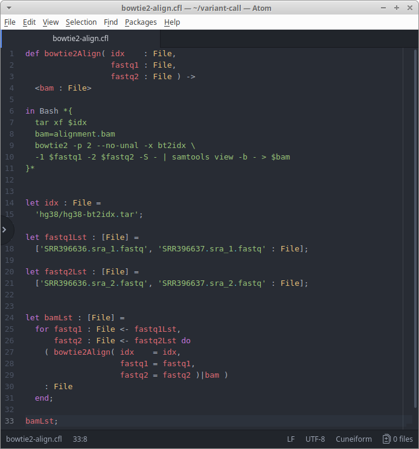

# cuneiform-atom
###### Syntax highlighting for Cuneiform in Atom

## Installation

### Atom Menu

In the main menu open **Edit** - **Preferences** which opens the Settings window. Now open the tab **Install** and search for the package `cuneiform-atom`.

### Command line

Alternatively, install through command line:

    apm install cuneiform-atom

## Authors

- Jörgen Brandt ([@joergen7](https://github.com/joergen7/)) [joergen@cuneiform-lang.org](mailto:joergen@cuneiform-lang.org)

## License

[Apache 2.0](https://www.apache.org/licenses/LICENSE-2.0.html)
